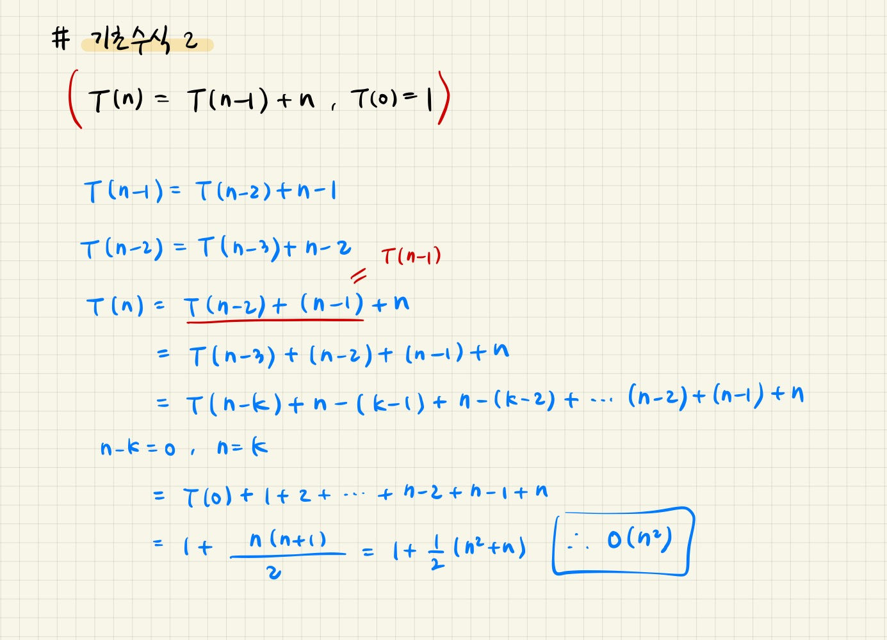

# Computational_Thinking

## 1. 논리와 증명 12

```
n^2이 3의 배수이면 n은 3의 배수임을 증명하라.
```


## 

## 2. 수와 표현 1

```
2진수 표현에서 logn 비트로 표현할 수 있는 숫자 범위는?
```


## 3. 수와 표현 2

```
스무고개가 이상적으로 진행된다고 할 때, 맞출 수 있는 답의 종류는 몇 가지인가?
```


## 4. 수와 표현 3

```
n이 충분히 큰 값일 대 다음 중 어느 값이 더 큰가?  
각 쌍에 대해 비교하고 그 이유를 작성하시오.
```


## 5. 수와 표현 4

```
x = loga(yz)일 때 x를 2를 밑으로 하는 로그들로 표현하시오.  
단, 로그 함수의 인자는 모두 문자 하나여야 한다.
```


## 6. 수와 표현 5

```
다음 함수들의 역함수를 구하시오.
```


## 7. 기초수식 1

```
T(n) = T(n-1) + 1, T(0)=1
```


## 8. 기초수식 2

```
T(n) = T(n-1) + n, T(0)=1
```



## 9. 기초수식 3

```
T(n) = T(n-1) + logn, T(0)=1
```


## 10. 기초수식 4

```
T(n) = T(n/2) + 1, T(1)=1
```


## 11. 기초수식 5

```
T(n) = T(n/2) + n, T(1)=1
```


