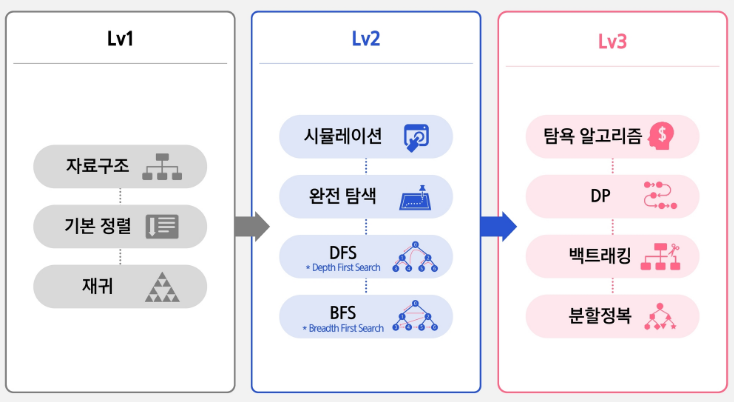

# SW 역량테스트 소개

## 1.IM

---
## 2. Type-A (A형)
- **Lv1 (2~3주)**
  - **자료구조, 정렬, 재귀** 등 알고리즘 문제 풀이에 필요한 기초 지식 학습
  - 기본 과정을 통해 SW 역량테스트에 필요한 기본기 학습
- **Lv2 (3주)**
  - Lv1에서 학습한 내용을 바탕으로 SW 역량 테스트 통과에 필수적인 **시뮬레이션, 완전탐색, DFS, BFS**에 대해 학습
  - 필수 과정을 통해 SW 역량테스트를 통과하기 위한 필수 기술 습득
- **Lv3 (3~4주)**
  - SW 역량테스트를 완벽히 준비할 수 있도록 더욱 다양한 알고리즘 기법들에 대해 학습
  - 심화 과정을 통해 어려운 SW 역량테스트를 통과하기 위한 기술 습득
    
=> 총 8 ~ 10주 학습

### 자기주도 학습 진행 방법
1. 유튜브 강의 시청
2. 블로그 및 참고자료 학습

---
## 3. Type-B (B형)
