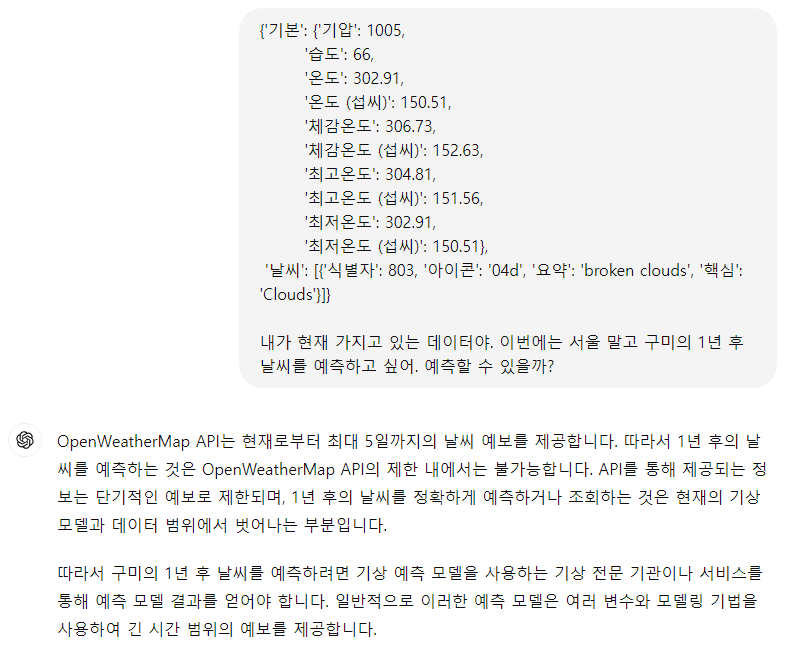
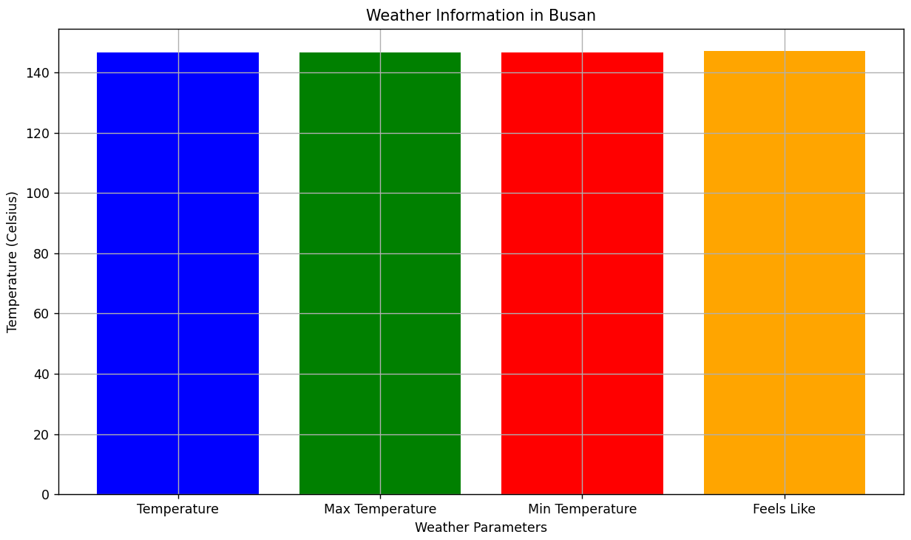

# 관통PJT

관통 프로젝트 명세서 및 예제 코드 저장소입니다.

아래 명령어를 이용하여 저장소를 로컬 PC로 Clone하여 활용합니다.

```bash
$ git clone https://lab.ssafy.com/s12/python/pjt
```


---


## PJT 버전 1

- 금융 프로젝트
### > problem 1
- 문제1. 날씨 데이터의 응답을 json 형태로 변환하여 key 값만 출력하시오.
```python
response = requests.get(url).json()
result = response.keys()
```

1. response에 요청을 보내 받아온 json 파일에서 `keys()` 함수를 이용해 날씨 데이터의 key값만을 추출하고자 했습니다.
- 딕셔너리의 key값과 value값 추출하는 방법은 수업시간에 배운 내용을 토대로 진행할 수 있었습니다.


### > problem 2
- 문제2. 날씨 데이터 중 다음 조건에 해당하는 값만 딕셔너리 형태로 반환하는 함수를 구성합니다.
```python
def get_weather(api_key):
    city = "Seoul,KR"
    url = f'http://api.openweathermap.org/data/2.5/weather?q={city}&appid={api_key}'

    response = requests.get(url).json()

    result = {}

    for key in ['main', 'weather']:
        result[key] = response[key]

    return result
```  
1. 원하는 key 값들을 리스트에 묶어 `for문`을 이용했습니다.
2. 빈 딕셔너리 값인 `result`에 해당되는 key값과 value 값을 새롭게 추가하는 형식으로 진행했습니다.
- 비어있는 딕셔너리에 key, value 값을 추가하는 방법 또한 수업시간에 배운 내용을 토대로 수행할 수 있었습니다.

### > problem 3
- 문제3. B번에서 얻는 결과를 활용하여, KEY 값들을 한글로 변경한 딕셔너리를 반환하도록 구성합니다.
```python
korean = {
    'feels_like': '체감온도',
    'humidity': '습도',
    'pressure': '기압',
    'temp': '온도', 
    'temp_max': '최고온도',
    'temp_min': '최저온도',
    'description': '요약',
    'icon': '아이콘',
    'main': '핵심',
    'id': '식별자',

result = {'기본': {},
              '날씨': [{}],
            }
    for key in korean:
        if key in response['main']:
            result['기본'][korean[key]] = response['main'][key]
        elif key in response['weather'][0]:
            # Check if the value is a list (like 'main' or 'description')
            if isinstance(response['weather'][0][key], list):
                result['날씨'][korean[key]] = [response['weather'][0][key]]
            else:
                result['날씨'][0][korean[key]] = response['weather'][0][key]
}
```
1. `result`는 '기본'과 '날씨' 2개의 키를 가진 딕셔너리입니다.
2. `korean`딕셔너리의 각 키를 순회하고, 해당 영문 키에 해당하는 값을 한글로 변환하여 '기본' 딕셔너리에 저장합니다.
3. 해당 영문 키에 해당하는 값을 한글로 변환하여 '기본' 딕셔너리에 저장합니다.
4. 영문 키가 'weather'에 있는 경우
    1. 영문 키에 해당하는 값이 리스트인 경우,  리스트로 변환하여 '날씨'에 저장합니다.
    2. 그렇지 않은 경우, 단일 값으로 저장합니다.
- for문의 변수 값에서 key값과 인덱스 값을 생각해가면서 코드를 작성해야 하다보니, 헷갈리는 부분도 많았고 시간이 많이 걸렸던 것 같습니다.


### > problem 4
1. `round((kelvin - 32) * 5 / 9, 2)` 화씨온도를 섭씨온도로 바꾸는 것을 'kelvin_to_celsius'라는 함수에 저장했습니다.
2. '기본'과 '날씨' 두 개의 키를 가진 빈 딕셔너리 및 빈 딕셔너리가 들어있는 리스트로 초기화됩니다.
3. 영문 키를 한글로 변환하여 '기본' 딕셔너리에 저장합니다.
    - `korean` 딕셔너리를 이용하여 영문 키를 한글로 변환하고, 해당하는 값이 `response['main']`에 있으면 해당 키-값을 '기본' 딕셔너리에 저장합니다.
4. 영문 키를 한글로 변환하여 '날씨'에 저장합니다.
    - 마찬가지로 `korean` 딕셔너리를 이용하여 영문 키를 한글로 변환하고, `response['weather'][0]`에 있는 데이터를 '날씨'에 저장합니다. 리스트 형태인 경우는 리스트로 저장하고, 그렇지 않은 경우에는 단일 값으로 저장합니다.
5. '기본' 딕셔너리와 '날씨' 리스트의 첫 번째 요소에 대해 온도 관련 키들을 순회하면서 섭씨 온도로 변환하여 저장합니다.
- 섭씨 온도 관련 값을 추가하는 부분이라 `problem3`의 코드에 몇 줄만 더 추가하면 된다고 간단하게 생각해 더 오래 걸렸던 문제입니다.
- 비어있는 딕셔너리에 추가할 때, 온도 관련 키들을 순회하면서 섭씨 온도로 변환하여 저장하는 것을 구현하는 것을 적다보니 코드가 길어져 보다 간결한 방법이 없나 고민이 약간 더 필요할 것 같습니다.


### > problem 5
1. 프롬프트 화면 캡처  


2. 코드
- 부산의 온도(온도, 최고온도, 최저온도, 체감온도)를 섭씨를 기준으로 막대그래프로 나타내고자 했습니다.
```python
# 온도 데이터 추출
temperatures = [
    result['기본']['온도 (섭씨)'],
    result['기본']['최고온도 (섭씨)'],
    result['기본']['최저온도 (섭씨)'],
    result['기본']['체감온도 (섭씨)'],
]
labels = ['Temperature', 'Max Temperature', 'Min Temperature', 'Feels Like']

# 막대 그래프 그리기
plt.figure(figsize=(10, 6))  # 그래프 사이즈 설정

plt.bar(labels, temperatures, color=['blue', 'green', 'red', 'orange'])  # 막대 그래프 생성

# 그래프 제목과 축 레이블 설정
plt.title('Weather Information in Busan')
plt.xlabel('Weather Parameters')
plt.ylabel('Temperature (Celsius)')

# 그래프 표시
plt.grid(True)  # 그리드 표시 (선택적)
plt.tight_layout()  # 레이아웃 최적화 (선택적)
plt.show()
```

3. 코드 실행 결과 


### PJT 버전 2

- 영화 프로젝트