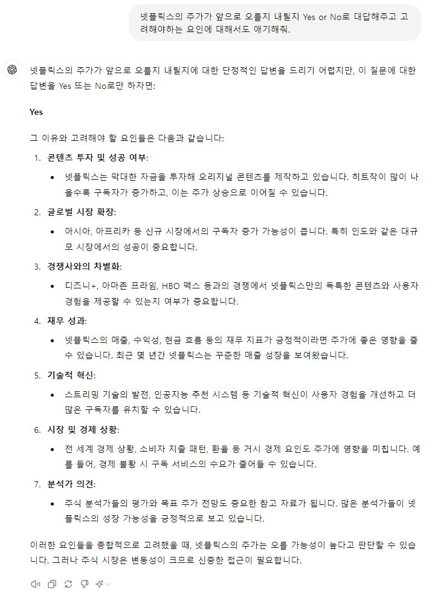

# 관통PJT

관통 프로젝트 명세서 및 예제 코드 저장소입니다.

아래 명령어를 이용하여 저장소를 로컬 PC로 Clone하여 활용합니다.

```bash
$ git clone https://lab.ssafy.com/s12/python/pjt
```


---


### PJT 버전 1

- 금융 프로젝트

#### 사용 라이브러리
Numpy, Pandas, Matplotlib

#### > Problem - A
- 데이터 전처리
  - Pandas를 사용해 csv 파일(NLFX.csv)을 DataFrame으로 읽어오기
  - 이 때, ['Data', 'Open', 'High', 'Lows', 'Close'] 필드만 읽어오도록 구성

```python
nflx = pd.read_csv("archive/NFLX.csv")
nflx = nflx[['Date', 'Open', 'High', 'Low', 'Close']]
nflx
```
- 원하는 필드를 기존 nflx 변수에 새롭게 저장하여 분석을 시작하고자 했습니다.
- 원하는 필드만 읽어오려면 2개의 대괄호가 필요하다는 것을 알 수 있었습니다.

#### > Problem - B
- 2021 이후의 종가 데이터 출력하기

  - csv 파일 DataFrame으로 읽어와 2021년 이후의 데이터만 필터링하기
    - [힌트] 필터링이 가능한 형식으로 데이터 타입을 변경한 후 필터링 진행
    - pandas의 to_datetime() 활용
  - 필터링이 완료된 DataFrame의 종가 데이터를 Matplotlib를 사용해 시각화하기

```python
# 날짜 데이터 변환
nflx["Date"] = pd.to_datetime(nflx["Date"])

# 2021년 이후 데이터만 필터링하기
nflx["Year"] = nflx['Date'].dt.year  # 연도 추출
nflx = nflx[nflx['Year']>=2021]
```

- 기존의 날짜 데이터는 object 타입이므로 필터링을 하기 위해 `to_datetime` 함수를 이용했습니다.
- nflx 변수명을 2021년도 이후의 데이터만 저장되도록 새롭게 지정했습니다.
- 날짜 데이터 필터링을 위해 사용해야 하는 함수를 알게 되었고, 원하는 조건의 데이터만 뽑아오기 위해 `기존 데이터 변수명[조건]`과 같이 작성하는 법을 알게 되었습니다.

#### > Problem - C
- 2021 이후 최고, 최저가 출력하기
  - csv 파일을 DataFrame으로 읽어와 2021년 이후의 데이터만 필터링하기
  - 종가(Close) 필드를 활용하여, 2021년 이후 가장 높은 종가와 가장 낮은 종가 출력
  - Pandas의 내장 함수 사용
  - 출력 결과 예시  
      ```python
      print("최고 종가: ", max_price)
      print("최저 종가: ", min_price)
      ```

```python
max_price = max(nflx['Close'])
min_price = min(nflx['Close'])

print("최고 종가: ", max_price)
print("최저 종가: ", min_price)
```
- mix, max 함수를 이용해 최고/최저 종가를 구할 수 있었습니다.

#### > Problem - D
- 2021 이후 월 별 평균 종가 출력하기
  - csv 파일을 DataFrame으로 읽어와 2021년 이후의 데이터만 필터링
  - 월 별로 그룹화하여 평균 종가를 계산한 새로운 DataFrame을 만들어 그래프로 시각화하기

```python
nflx['Year_Month'] = nflx['Date'].dt.strftime('%Y-%m')
nflx_group = nflx.groupby(nflx['Year_Month'])['Close'].mean()
nflx_group

average_nflx = nflx_group.reset_index()
average_nflx.columns = ['Year_Month', 'Average_ym']
average_nflx
```

- 처음에 `월`만을 기준으로 그래프를 그려보니, 2021-01의 1월과 2022-01의 1월 데이터가 합쳐져 전혀 다른 모양의 그래프가 나왔습니다.
- `연도와 월`을 함께 봐야 한다는 생각에 dt.strftime('%Y-%m-%d) 함수를 사용하고자 하였고, 이후 원하는 그래프의 모습을 얻을 수 있었습니다.
- groupby 함수 사용법에 대해 알게 되었습니다. 
  - `변수명.groupby(변수명['원하는 컬럼'])['계산할 컬럼'].계산을 적용할 함수`
  - ex. `nflx.groupby(nflx['Year_Month'])['Close'].mean()`


#### > Problem - E
- 2022년 1월 이후 월 별 최고, 최저, 종가 시각화
  - csv 파일을 DataFrame으로 읽어와 2022년 이후의 데이터만 필터링
  - Matplotlib을 활용해 3가지 필드 한 번에 분석할 수 있도록 시각화하기

```python
# 그래프 그리기
plt.plot(nflx['Date'], nflx['Close'], label='Close')
plt.plot(nflx['Date'], nflx['Low'], label='Low')
plt.plot(nflx['Date'], nflx['High'], label='High')

# 범례 표시
plt.legend()
```

- X축 Date 컬럼과 Y축 Close 컬럼을 이용해 그래프를 작성하고, label 파라미터를 작성하여 범례를 작성했습니다.
- 범례를 작성하기 위해 label을 사용하고, legend() 범레를 작성해야 한다는 것을 배울 수 있었습니다.


#### > Problem - F
- 주가를 예측하도록 프롬프트 구성
- 생성형 AI와 나눈 대화와 결과 캡처 후 제출



### PJT 버전 2

- 영화 프로젝트